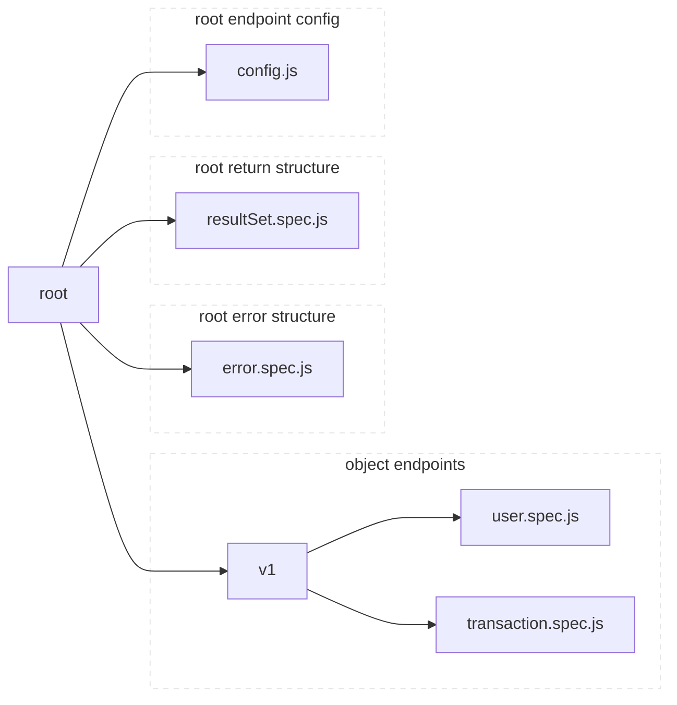

Perigress Setup
===============

Perigress (in most cases) uses a directory which mirrors the path of the endpoints. For example, given:

you'll have the following endpoints:

- `/v1/user/:id`
- `/v1/user/:id/edit`
- `/v1/user/list`
- `/v1/transaction/:id`
- `/v1/transaction/:id/edit`
- `/v1/transaction/list`
